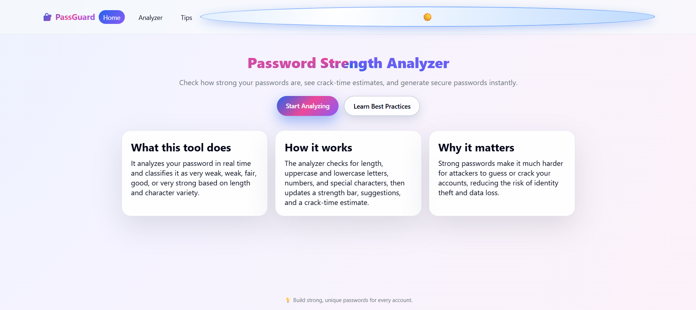
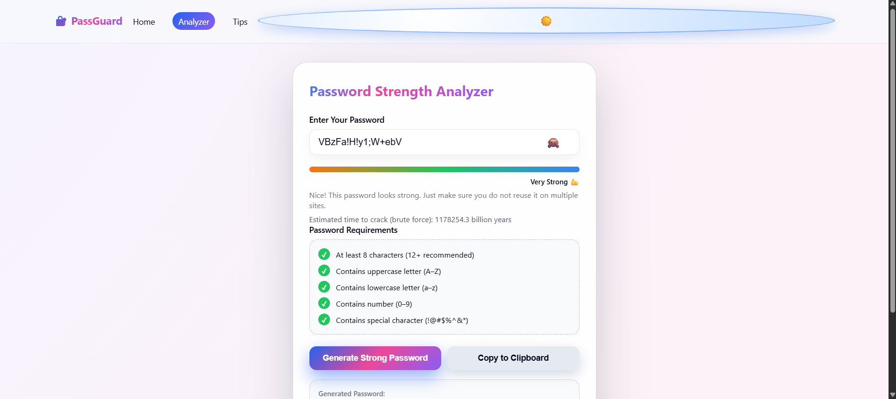
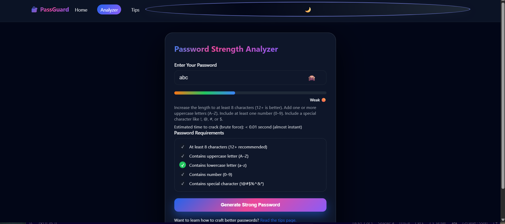
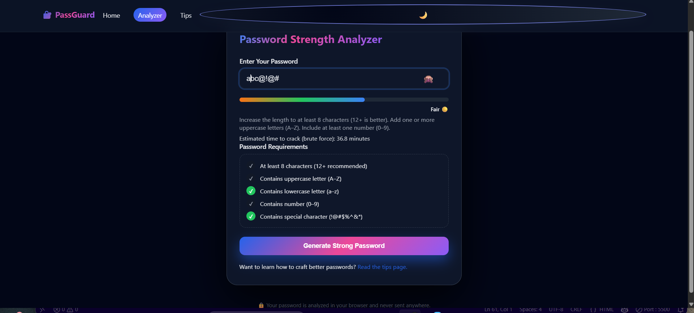
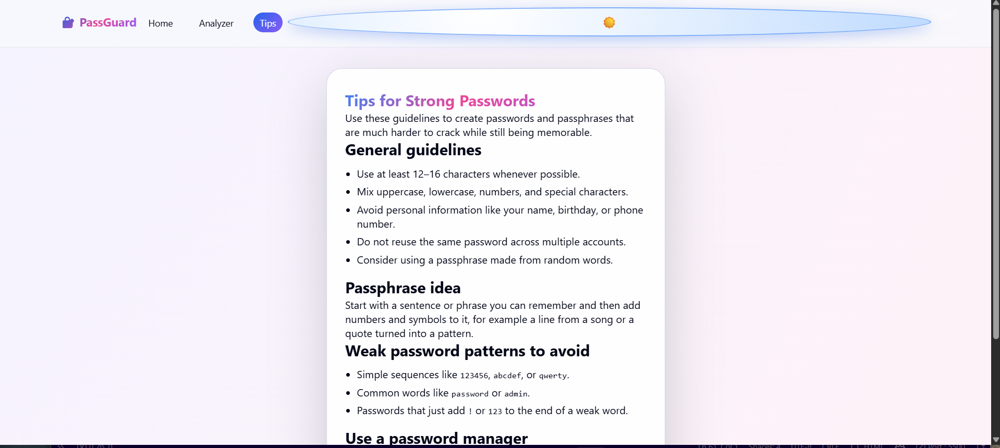

# 🔐 PassGuard - Password Strength Analyzer

**Check how strong your passwords are, see crack-time estimates, and generate secure passwords instantly.**

---

## 📋 About

**PassGuard** is a comprehensive, user-friendly password strength analyzer tool that helps you create and evaluate secure passwords in real-time. It provides instant feedback on password strength, displays detailed crack-time estimates, offers personalized suggestions for improvement, and can generate strong passwords automatically. All analysis happens locally in your browser—your passwords are never sent to any server.

Whether you're a casual user looking to strengthen your personal accounts or a security-conscious individual wanting to understand password security better, PassGuard provides an intuitive interface with professional-grade security insights.

---

## ✨ Features

### 🎯 Core Features
- **Real-time Password Analysis** – Instantly check password strength as you type
- **Strength Classification** – Five-level strength ratings: Very Weak, Weak, Fair, Good, and Very Strong
- **Crack Time Estimation** – Realistic estimates of how long it would take to crack your password using brute-force attacks
- **Personalized Suggestions** – Get actionable tips to improve your password strength
- **Requirements Checklist** – Visual indicator showing which password criteria you've met:
  - Minimum 8 characters (12+ recommended)
  - Uppercase letters (A–Z)
  - Lowercase letters (a–z)
  - Numbers (0–9)
  - Special characters (!@#$%^&*)

### 🔧 Generator & Utilities
- **Strong Password Generator** – One-click generation of cryptographically secure 16-character passwords
- **Copy-to-Clipboard** – Easily copy generated passwords with a single click
- **Password Visibility Toggle** – Show/hide password while typing for privacy

### 🎨 User Experience
- **Dark/Light Mode** – Toggle between light and dark themes with persistent preferences
- **Responsive Design** – Works seamlessly on desktop, tablet, and mobile devices
- **Multi-page Navigation** – Three dedicated pages:
  - **Home** – Overview and project information
  - **Analyzer** – Main password analysis tool
  - **Tips** – Best practices for creating strong passwords
- **Client-Side Processing** – All analysis runs locally; no passwords are transmitted to servers

---

## 📸 Screenshots

### Home Page
Homepage showcasing the project overview and quick navigation.


### Password Analyzer Tool
Main analyzer with strength meter, requirements checklist, and crack-time estimate.


### Weak Password Analysis
Real-time feedback for weak passwords with actionable suggestions.


### Crack Time Estimation
Detailed time-to-crack estimates based on password complexity.


### Tips & Best Practices Page
Educational content with guidelines for creating strong passwords.


---

## 🛠️ Tech Stack

### Frontend
- **HTML5** – Semantic markup and structure
- **CSS3** – Advanced styling with gradients, animations, and responsive layouts
- **Vanilla JavaScript** – Pure JS for password analysis and DOM manipulation (no frameworks)

### Key Technologies
- **Local Storage API** – Persistent theme preference storage
- **Regular Expressions** – Password pattern matching and validation
- **Client-Side Crypto Logic** – Brute-force crack-time estimation algorithms

### Compatibility
- Modern browsers (Chrome, Firefox, Safari, Edge)
- No external dependencies or frameworks required
- Lightweight and fast-loading

---

## 📁 Project Structure

```
PASSWORD-STRENGTH-ANALYZER/
├── index.html              # Home page with project overview
├── analyzer.html           # Main password analysis tool
├── tips.html              # Password security tips and best practices
├── script.js              # Shared JavaScript functionality and analyzer logic
├── style.css              # Complete styling with light/dark mode support
├── README.md              # Project documentation (this file)
├── screenshots/           # Project screenshots
│   ├── home-page.png.png
│   ├── analyzer-strong.png.png
│   ├── analyzer-weak.png.png
│   ├── crack-time.png.png
│   └── tips-page.png.png
└── .git/                  # Version control directory

**File Descriptions:**
- `index.html` – Landing page with project description and navigation
- `analyzer.html` – Interactive tool for password strength analysis
- `tips.html` – Educational guide for creating secure passwords
- `script.js` – Contains theme toggle logic, password validation, strength calculation, and password generation
- `style.css` – Responsive styling with animations, gradients, and dark/light mode themes
```

---

## 🚀 Usage

### Getting Started

1. **Clone or Download the Project**
   ```bash
   git clone <repository-url>
   cd PASSWORD-STRENGTH-ANALYZER
   ```

2. **Open in Browser**
   - Simply open `index.html` in your web browser
   - Or use a local server:
     ```bash
     # Using Python
     python -m http.server 8000
     
     # Using Node.js (with http-server)
     npx http-server
     ```
   - Then navigate to `http://localhost:8000`

### How to Use the Analyzer

1. **Enter Your Password**
   - Type your password in the input field on the Analyzer page
   - The analysis updates in real-time as you type

2. **Review Strength Indication**
   - Watch the strength bar fill with color from red (weak) to green (strong)
   - Read the strength level: Very Weak → Weak → Fair → Good → Very Strong

3. **Check Requirements**
   - Review the checklist to see which criteria your password meets
   - Look for visual indicators (✓) showing completed requirements

4. **Review Suggestions**
   - Get personalized tips on how to improve your password
   - Follow the suggestions to increase strength

5. **Check Crack Time**
   - See the estimated time it would take to crack your password
   - Use this to understand the real-world security of your password

6. **Generate a Strong Password** (Optional)
   - Click "Generate Strong Password" for an automatic secure password
   - Copy it to your clipboard immediately
   - Or manually test your own password

### Theme Toggle
- Click the ☀️ (sun) or 🌙 (moon) icon in the header to switch between light and dark modes
- Your preference is saved automatically

### Navigation
- **Home** – View project overview and features
- **Analyzer** – Access the main password analysis tool
- **Tips** – Learn best practices for password creation

---

## ⚙️ How It Works

### Password Strength Calculation

The analyzer uses a **scoring algorithm** based on multiple criteria:

**Base Score (20 points per criterion met):**
- ✓ Minimum 8 characters → 20 points
- ✓ Uppercase letters (A–Z) → 20 points
- ✓ Lowercase letters (a–z) → 20 points
- ✓ Numbers (0–9) → 20 points
- ✓ Special characters (!@#$%^&*) → 20 points

**Bonus Points:**
- +10 points if length ≥ 12 characters
- +10 points if length ≥ 16 characters

**Strength Classification:**
- **<20 points** – Very Weak 🔴 (0–20% bar)
- **20–39 points** – Weak 🟠 (20–40% bar)
- **40–59 points** – Fair 🟡 (40–60% bar)
- **60–79 points** – Good 🟢 (60–80% bar)
- **80+ points** – Very Strong 💪 (80–100% bar)

### Crack Time Estimation

The tool estimates how long a brute-force attack would take:

**Formula:**
```
Charset Size = 26 (lowercase) + 26 (uppercase) + 10 (digits) + 32 (special)
Total Combinations = Charset Size ^ Password Length
Guesses Per Second = 1 billion (realistic modern hardware)
Time = Total Combinations / Guesses Per Second / 2 (average)
```

**Examples:**
- 8-character mixed case: ~hours to days
- 12-character strong password: ~years to decades
- 16-character complex password: ~millions of years

### Password Generation

The built-in generator:
1. Creates a 16-character password
2. Ensures at least one character from each category (uppercase, lowercase, number, special)
3. Randomly shuffles the remaining characters for true randomness

---

## 🔒 Privacy & Security

✅ **Your passwords are 100% safe:**
- All analysis happens **entirely in your browser**
- No data is sent to any server
- No cookies or tracking
- No logs are kept
- You maintain complete control

---

## 📚 Password Best Practices (from Tips Page)

### General Guidelines
- Use at least **12–16 characters** whenever possible
- Mix **uppercase, lowercase, numbers, and special characters**
- Avoid **personal information** (name, birthday, phone number)
- **Don't reuse passwords** across multiple accounts
- Consider using **passphrases** made from random words

### Passphrase Example
- Start with a memorable sentence: *"I love coding at 2 AM"*
- Transform it: *"Il0v3c0d1ng@2AM!"*
- This is both memorable and very strong

### Weak Patterns to Avoid
- ❌ Simple sequences: `123456`, `abcdef`, `qwerty`
- ❌ Common words: `password`, `admin`, `letmein`
- ❌ Pattern additions: `MyPassword123`, `Company2024`

### Use a Password Manager
Consider tools like **1Password, Bitwarden, or LastPass** to:
- Generate and store long, random passwords
- Remember only one strong master password
- Auto-fill passwords securely

---

## 🎯 Use Cases

- **Personal Security** – Strengthen your everyday account passwords
- **Educational Purpose** – Learn how password security works
- **Compliance Testing** – Check if passwords meet organizational requirements
- **Security Awareness** – Understand the impact of password complexity
- **Developer Tool** – Use the logic in your own security applications

---

## 🌐 Browser Compatibility

| Browser | Support |
|---------|---------|
| Chrome  | ✅ Full |
| Firefox | ✅ Full |
| Safari  | ✅ Full |
| Edge    | ✅ Full |
| Opera   | ✅ Full |

*Requires JavaScript enabled and modern browser features (ES6+)*

---

## 📦 Installation & Deployment

### Local Development
```bash
# Clone the repository
git clone <repository-url>

# Navigate to directory
cd PASSWORD-STRENGTH-ANALYZER

# Open in default browser
start index.html

# Or use a local server
python -m http.server 8000
# Visit: http://localhost:8000
```

### Deploy Online
Deploy to any static hosting service:
- **GitHub Pages** – Free hosting with `gh-pages` branch
- **Vercel** – Zero-config deployment
- **Netlify** – Drag-and-drop deployment
- **AWS S3** – Scalable static hosting
- **Your own server** – Copy files to any web server

---

## 🐛 Known Limitations

- Crack time estimates assume standard brute-force attacks; they don't account for advanced techniques like rainbow tables or GPU-accelerated hashing
- The tool doesn't check against known compromised password databases (like Have I Been Pwned)
- Special character recognition is based on common punctuation; some rare Unicode characters may not be counted

---

## 🚧 Future Enhancements

Potential features for future versions:
- ✨ Check passwords against compromised database (HIBP integration)
- ✨ Support for passphrase strength analysis
- ✨ Password entropy calculation and visualization
- ✨ Keyboard pattern detection (qwerty, diagonal patterns)
- ✨ Levenshtein distance checking for similarity to common words
- ✨ Export strength reports as PDF
- ✨ Keyboard accessibility improvements
- ✨ Multi-language support

---

## 📝 License

This project is open-source and available under the **MIT License**. Feel free to use, modify, and distribute it.

---

## 🤝 Contributing

Contributions are welcome! To contribute:

1. **Fork the repository**
2. **Create a feature branch** (`git checkout -b feature/amazing-feature`)
3. **Commit your changes** (`git commit -m 'Add amazing feature'`)
4. **Push to the branch** (`git push origin feature/amazing-feature`)
5. **Open a Pull Request**

---

## 📞 Contact & Support

### Have Questions?

📧 **Email:** [princenaware516@gmail.com](mailto:princenaware516@gmail.com)

📱 **Social Media:**
- GitHub: [@princenaware](https://github.com/princenaware)
- LinkedIn: [Prince Naware](https://linkedin.com/princenaware)

### Report Bugs
If you find a bug or have a suggestion:
1. Check existing issues on GitHub
2. Open a new issue with detailed description
3. Include screenshots or error messages if applicable

### Feedback
Your feedback helps improve PassGuard! Share your thoughts:
- What features would you like?
- What's confusing about the interface?
- How can we make password security more accessible?

---

## 🙏 Acknowledgments

- Password security best practices from NIST guidelines
- Design inspiration from modern security tools
- Community feedback and contributions

---

## 📊 Statistics

Created with care as a **demonstration of modern web development** combining:
- ✅ Pure HTML5 markup
- ✅ Advanced CSS3 styling and animations
- ✅ Vanilla JavaScript functionality
- ✅ Real-world password security algorithms
- ✅ Responsive design for all devices

---

**Stay secure! 🔐**

*Last Updated: February 2026*
